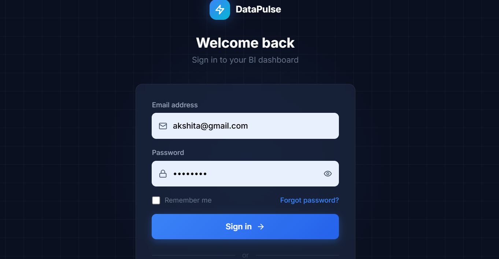
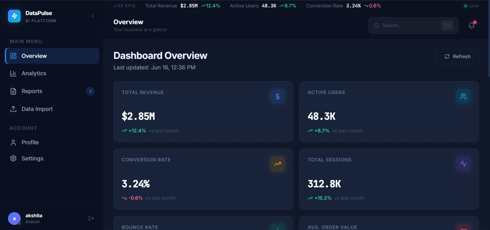
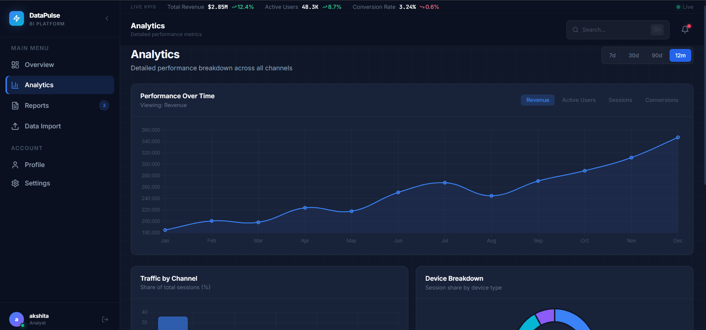
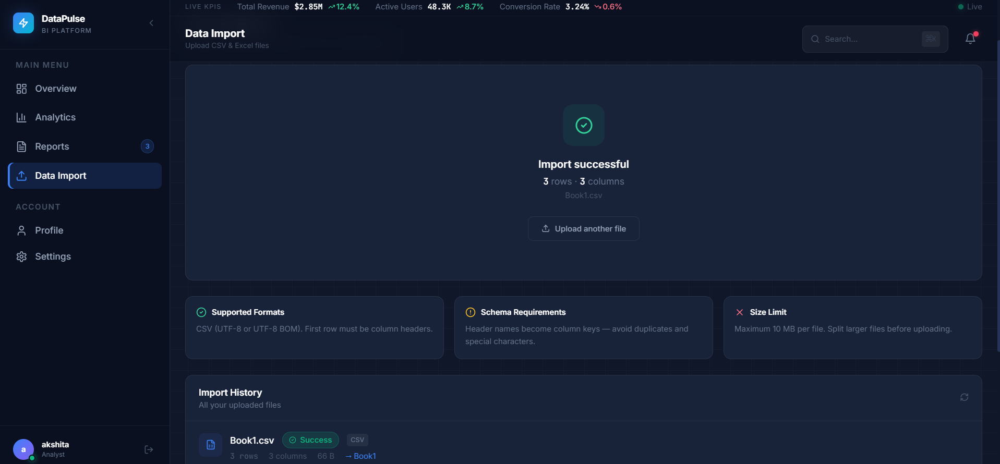

# Data Analytics & Business Intelligence Dashboard

A full-stack Business Intelligence platform built with React, TypeScript, Express.js, and PostgreSQL. The application enables businesses to import datasets, monitor key performance indicators, visualize trends through interactive charts, and generate exportable reports for decision-making.

## Features

### Authentication & Security

* JWT-based user authentication
* Secure login and registration
* Protected routes and API endpoints

### Dashboard & Analytics

* Interactive business dashboard
* KPI monitoring and tracking
* Revenue and performance analytics
* Data visualization using Chart.js
* Real-time business insights

### Data Management

* CSV data import functionality
* Dataset validation and processing
* Import history tracking
* Dataset preview before analysis
* Persistent PostgreSQL storage

### Report Management

* Generate custom business reports
* Export reports in PDF format
* Export reports in Excel format
* Export reports in CSV format
* Download and manage generated reports

### Database & Backend

* PostgreSQL database integration
* RESTful API architecture
* Secure data handling
* Import and reporting services

## Tech Stack

### Frontend

* React.js
* TypeScript
* Tailwind CSS
* Chart.js
* React Router

### Backend

* Node.js
* Express.js
* PostgreSQL
* JWT Authentication

## Project Structure

```text
bi-dashboard/
├── src/                     # Frontend
├── bi-dashboard-backend/    # Backend
├── package.json
└── vite.config.ts
```

## Screenshots

### Login Page



### Dashboard Overview



### Analytics Dashboard



### Data Import




### Reports & Export


## Installation

### Frontend

```bash
npm install
npm run dev
```

### Backend

```bash
cd bi-dashboard-backend
npm install
npm run dev
```

## Future Enhancements

* Support for Excel and JSON imports
* Advanced dashboard customization
* Multi-user collaboration features
